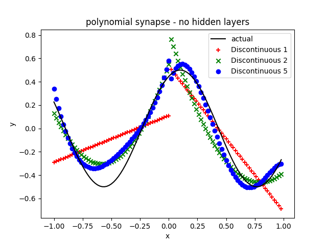

[](https://travis-ci.org/jloveric/piecewise-polynomial-layers)

# Piecewise Polynomial Layers for Tensorflow
Tensorflow layers using piecewise Chebyshev polynomials.  Long ago I wrote a c++ code that explored higher 
order weights in the synapse of a standard neural network [here](https://www.researchgate.net/publication/276923198_Discontinuous_Piecewise_Polynomial_Neural_Networks) .  Here we have some of that capability in Tensorflow.

## Idea

The idea is extremely simple - instead of a single weight at the synapse, use n-weights.  The n-weights describe a piecewise polynomial and each of the n-weights can be updated independently.  A Chebyshev polynomial and gauss lobatto points are used to minimize oscillations of the polynomial.

## Why

Using higher order polynomial representations might allow networks with much fewer total weights. In physics, higher order methods
can be much more efficient, (while being more complex to implement). Spectral and discontinuous galerkin methods are examples of this.  Note that a standard neural network with relu activations is piecewise linear.  Here there are no bias weights and the "non-linearity" is in the synapse. 

In addition, it's well known that the dendrites are also computational units in neurons, for example [Dendritic action potentials and computation in human layer 2/3 cortical neurons](https://science.sciencemag.org/content/367/6473/83) and this is a simple way to add more computational power into the artificial neural network model.

# Installation

```bash
pip install snovalleyai-piecewise-polynomial-layers
```

# Use

```python
import tensorflow as tf
import snovalleyai_piecewise_polynomial_layers.PolynomialLayers as poly
from tensorflow.keras.layers import *
mnist = tf.keras.datasets.mnist

(x_train, y_train),(x_test, y_test) = mnist.load_data()
x_train, x_test = (x_train / 128.0-1.0), (x_test / 128.0-1.0)

units = 20

basis = poly.b3

model = tf.keras.models.Sequential([
  Flatten(input_shape=(28, 28)),
  poly.Polynomial(units, basis=basis),
  LayerNormalization(),
  poly.Polynomial(units, basis=basis),
  LayerNormalization(),
  poly.Polynomial(units, basis=basis),
  LayerNormalization(),
  poly.Polynomial(units, basis=basis),
  LayerNormalization(),
  Dense(10, activation='softmax')
])

model.compile(optimizer='adam',
              loss='sparse_categorical_crossentropy',
              metrics=['accuracy'])

model.fit(x_train, y_train, epochs=20, batch_size=10)
model.evaluate(x_test, y_test)
```

# Examples

Run the example from the main directory.  For the functionExample case run
```bash
python3 -m examples.functionExample
```

1. [invariant mnist](examples/invariantMnistExample.py)
2. [convolutional neural network mnist](examples/mnistCNNExample.py)
3. [fitting a sin wave](examples/functionExample.py)
4. [cifar10 convolutional neural network](examples/cifar10CNNExample.py)
5. [invariant cifar10](examples/invariantCIFAR10Example.py)

These examples have not been tuned.

# Example - Simple Polynomial

Here is the result for fitting a sin wave with no hidden layers.  There is only one input neuron and one output neuron and no neuronal non-linearity.  Solution is for a linear, quadratic and 5th order polynomial used in the synapse - there are 6 weights in the 5th order polynomial and 2 units total (1 input and 1 output).


# Example 2 - Piecewise Discontinuous Polynomial (2 pieces)

Same problem, but comparison between 1st 3rd and 5th order piecewise discontinuous polynomial synapses.  This also works in deep networks - whether it's useful, that's a different question.  However, for problems that have discontinuities, like fluid mechanics, it might be useful.



# Example 3 - Piecewise Continuous Polynomial (2 pieces)

Same problem, but comparison between 1st 3rd and 5th order piecewise continuous polynomial synapses.


# Comparison with ReLU layer

It should be easy to solve this problem with a standard ReLU layer, well here are some results. The ReLU does not do a great job of fitting this curve, this is not surprising given that the set of functions you are constructing the sin wave from are not orthogonal.

Adding a second layer and we get the result we expect.  However, at the cost of a massive increase in the total number of weights.  Since we are using a dense layer in the case of 5 units per layer we have a total of 35 weights.  At 10 units per layer we have 120 weights...  5th order polynomial pair has a total of 12 weights in the discontinuous case and 11 in the continuous case.  So, it's possible the number of weights decreases by as much as an order of magnitude - more research necessary, however this is inline with results from computational physics.


# Available polynomial orders

```python
import snovalleyai_piecewise_polynomial_layers.PolynomialLayers as poly

#Non piecewise polynomials
poly.b1 #linear chebyshev
poly.b2 #quadratic chebyshev
poly.b3 #3rd order chebyshev
boly.b4 #4th order chebyshev
poly.b5 #5th order chebyshev

## Discontinous piecewise polynomials, 2 pieces
poly.b1D #linear chebyshev (discontinuous pair)
poly.b2D #quadratic chebyshev (discontinuous pair)
poly.b5D #5th order chebyshev (discontinuous pair)

## Continuous piecewise polynomials, 2 pieces
poly.b1C #linear chebyshev (continuous pair)
poly.b2C #quadratic chebyshev (continuous pair)
poly.b5C #5th order chebyshev (continuous pair)
```
The layer inside tensorflow is then called (see mnist example above)
```
poly.Polynomial(units, input, basis=basis),
```
where units is the number of units and input is the size of the input and basis would be 'poly.b3' for example.
