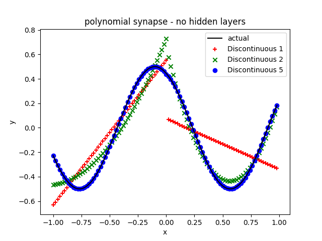
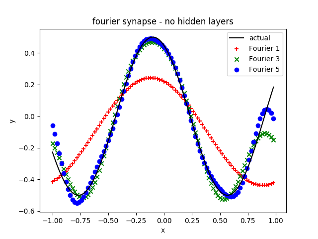
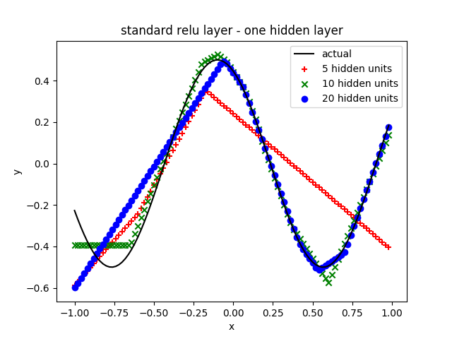
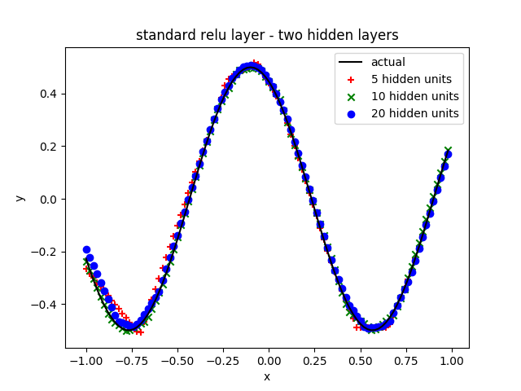

[](https://travis-ci.org/jloveric/piecewise-polynomial-layers)
[](https://zenodo.org/record/3628932#.Xi-RAd-YXRY)
# Piecewise Polynomial and Fourier Series Layers for Tensorflow
Tensorflow layers using piecewise Lagrange polynomials with Gauss Lobatto nodes (I'm also adding truncated fourier series and other orthogonal functions).  This is a technique commonly used in finite element
analysis and means that the weight assigned to each node is exactly the function value at that node.  Long ago I wrote a c++ code that explored higher 
order polynomials in the synapse of a standard neural network [here](https://www.researchgate.net/publication/276923198_Discontinuous_Piecewise_Polynomial_Neural_Networks) .  Here I'm implementing some of that capability in Tensorflow.

## Idea

The idea is extremely simple - instead of a single weight at the synapse, use n-weights.  The n-weights describe a piecewise polynomial and each of the n-weights can be updated independently.  A Lagrange polynomial and Gauss Lobatto points are used to minimize oscillations of the polynomial.

## Why

Using higher order polynomial representations might allow networks with much fewer total weights. In physics, higher order methods
can be much more efficient, (while being more complex to implement). Spectral and discontinuous galerkin methods are examples of this.  Note that a standard neural network with relu activations is piecewise linear.  Here there are no bias weights and the "non-linearity" is in the synapse. 

In addition, it's well known that the dendrites are also computational units in neurons, for example [Dendritic action potentials and computation in human layer 2/3 cortical neurons](https://science.sciencemag.org/content/367/6473/83) and this is a simple way to add more computational power into the artificial neural network model.

# Installation

```bash
pip install snovalleyai-piecewise-polynomial-layers
```

# Use

```python
import tensorflow as tf
import snovalleyai_piecewise_polynomial_layers.PolynomialLayers as poly
from tensorflow.keras.layers import *
mnist = tf.keras.datasets.mnist

(x_train, y_train),(x_test, y_test) = mnist.load_data()
x_train, x_test = (x_train / 128.0-1.0), (x_test / 128.0-1.0)

units = 20

basis = poly.b3

model = tf.keras.models.Sequential([
  Flatten(input_shape=(28, 28)),
  poly.Polynomial(units, basis=basis, shift=0.0),
  LayerNormalization(),
  poly.Polynomial(units, basis=basis, shift=0.0),
  LayerNormalization(),
  poly.Polynomial(units, basis=basis, shift=0.0),
  LayerNormalization(),
  poly.Polynomial(units, basis=basis, shift=0.0),
  LayerNormalization(),
  Dense(10, activation='softmax')
])

model.compile(optimizer='adam',
              loss='sparse_categorical_crossentropy',
              metrics=['accuracy'])

model.fit(x_train, y_train, epochs=20, batch_size=10)
model.evaluate(x_test, y_test)
```

# Examples

Run the example from the main directory.  For the functionExample case run
```bash
python functionExample.py
```

1. [invariant mnist](invariantMnistExample.py)
2. [convolutional neural network mnist](mnistCNNExample.py)
3. [fitting a sin wave](functionExample.py)
4. [cifar10 convolutional neural network](cifar10CNNExample.py)
5. [invariant cifar10](invariantCIFAR10Example.py)
6. [reinforcement learning inverted pendulum Fourier series](inverted_pendulum_rl.py)

These examples have not been tuned.

# Fitting a function

The examples below are super simple - just fit a shifted sin wave.  Using the Lagrange Polynomial layers here a single input and ouput unit with no hidden layers is sufficient to fit the sin wave (as demonstrated below).  I'm hoping this helps illustrate exactly what is going on and why one might want to use a technique like this.  A comparison with a standard ReLU network with 1 and 2 hidden layers is provided for comparison.

## Example - Simple Polynomial

Solution is for a linear, cubic and 5th order polynomial used in the synapse - there are 6 weights in the 5th order polynomial and 2 units total (1 input and 1 output).


## Example 2 - Piecewise Discontinuous Polynomial (2 pieces)

Same problem, but comparison between 1st, 2nd and 5th order piecewise discontinuous polynomial synapse.  This could be useful in problems that
have discontinuties such as many problems in physics.



## Example 3 - Piecewise Continuous Polynomial (2 pieces)

Same problem, but comparison between 1st, 2nd and 5th order piecewise continuous polynomial synapse.


## Example 4 - Fourier series layer up to 5 frequencies

Same problem, but comparison between 1, 2 and 5 and 5 frequency fourier series.



## Comparison with ReLU layer

ReLU network for comparison.

Adding a second layer and we get the result we expect.  However, at the cost of a massive increase in the total number of weights.  Since we are using a dense layer in the case of 5 units per layer we have a total of 35 weights.  At 10 units per layer we have 120 weights...  5th order polynomial pair has a total of 12 weights in the discontinuous case and 11 in the continuous case.  So, it's possible the number of weights decreases by as much as an order of magnitude - more research necessary, however this is inline with results from computational physics.


## Available polynomial orders

```python
import snovalleyai_piecewise_polynomial_layers.PolynomialLayers as poly

#Non piecewise polynomials
poly.b1 #linear
poly.b2 #quadratic
poly.b3 #3rd order
boly.b4 #4th order
poly.b5 #5th order

## Discontinous piecewise polynomials, 2 pieces
poly.b1D #linear (discontinuous pair)
poly.b2D #quadratic (discontinuous pair)
poly.b3D #dubic (discontinuous pair)
poly.b4D #quartic (discontinuous pair)
poly.b5D #5th order (discontinuous pair)

## Continuous piecewise polynomials, 2 pieces
poly.b1C #linear (continuous pair)
poly.b2C #quadratic (continuous pair)
poly.b3C #cubic (continuous pair)
poly.b4C #quartic (continuous pair)
poly.b5C #5th order (continuous pair)
```
The layer inside tensorflow is then called (see mnist example above)
```
poly.Polynomial(units, input, basis=basis),
```
where units is the number of units and input is the size of the input and basis would be 'poly.b3' for example.

## Fourier Series Layer
In addition there is a fourier series layer
```python
import snovalleyai_piecewise_polynomial_layers.FourierLayers as fourier
...
layer = fourier.Fourier(units, frequencies=frequencies, length=2.0, shift=0.0)
```
where 'units' is the number of units, 'frequencies' is the number of frequencies to include and 'length' is the wavelength of the longest wave.