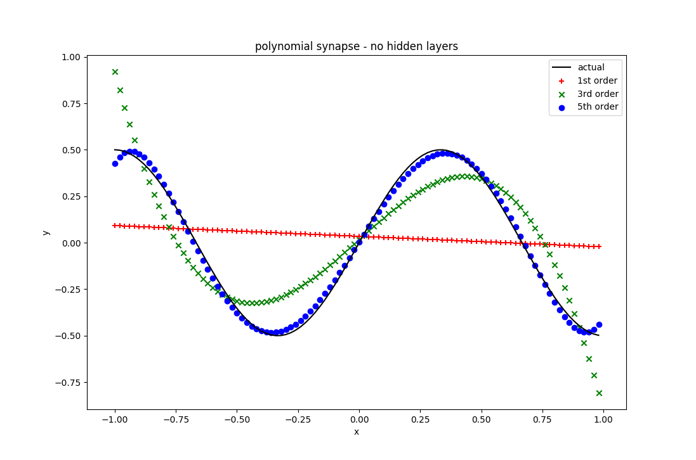

# Piecewise Polynomial Layers for Tensorflow
Tensorflow layers using piecewise Chebyshev polynomials.  Earlier I wrote a c++ code that explored higher 
order weights in the synapse of of a standard neural network [here](https://www.researchgate.net/publication/276923198_Discontinuous_Piecewise_Polynomial_Neural_Networks) .  This is an effort to reproduce that work in Tensorflow.  This is a work in progress and ultimately the layers will need to be done in c++ to get
reasonable performance.

The idea is extremely simple - instead of a single weight at the synapse, use n-weights.  The n-weights describe a piecewise polynomial and each of the n-weights can be updated independently.  A Chebyshev polynomial and gauss lobatto points are used to minimize oscillations of the polynomial.

# Example

Here is the result for fitting a sin wave with no hidden layers.  There is only one input neuron and one output neuron and no neuronal non-linearity.  A 5th order polynomial is used in the synapse - there are 6 weights and only one synapse in the network.

## Example 2

Same problem, but comparison between 1st 3rd and 5th order polynomial synapses.  A standard network would have a 0th order synapse, but offset by a bias weight (line possibly shifted from the origin).

